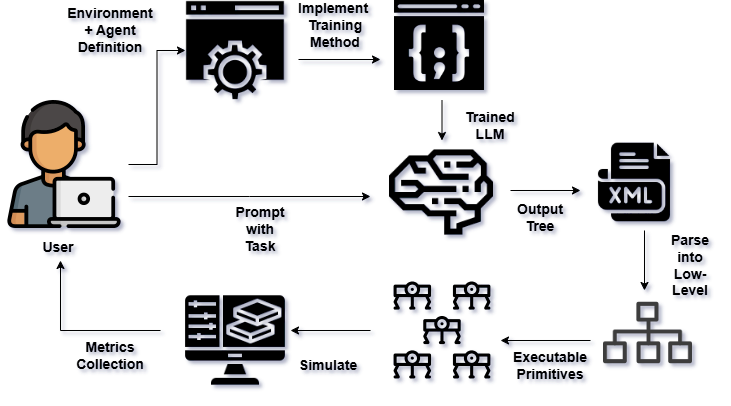

# MinionsLLM
Minions LLM is a Task-adaptive Framework for the Control of Multi-Agent Systems Through Natural Language by integrating Large Language Models with Behavior Trees and
Formal Grammars to enable natural language control of multi-agent systems within arbitrary, user-defined environments. 

## Disclaimer
This framework was built for the research for my masters thesis at VU Amsterdam, supervised by Dr. Eliseo Ferrante.
For a full explanation of the framework and experimental results, feel free to read my thesis: 

https://drive.google.com/file/d/19GDlBFKiZ7za9IqG7FQQxjw5b5SSKyLZ/view?usp=sharing

## Installation

1. **Clone the repository**:
    ```sh
    git clone https://github.com/andresgr96/MinionsLLM.git
    cd MinionsLLM
    ```

2. **Install the Framework (Linux)**:
    ```sh
    # Create a virtual environment
    python3 -m venv .venv
    source .venv/bin/activate

    # Install dependencies
    pip install -e .
    ```

## Introduction



MinionsLLM provides standardized interfaces for defining environments, agents, and behavioral primitives, and introduces a novel formal grammar based methodology for syntetic dataset generation to fine-tune LLMs for improved syntactic validity and task performance. Main packages:

– **LLM Interface**: This Package provides functionality to prompt LLMs locally using different backend options in order to get behavior trees.

– **Agent Control**: Provides functionality for the control of agents in a simulated environment through behavior trees.

– **Tree Parser**: Acting as middleware between the Interface and Control packages, it provides functionality to parse trees into executable commands for the agents.

– **Dataset Grammar**: Provides functionality to generate custom datasets through different methods.

## Usage

MinionsLLM provides several example scripts to help you get started with different aspects of the framework:

### 📁 Examples Overview

#### **Interface Prompting Examples** (`examples/interface_prompting/`)
Learn how to use the LLM interface to generate behavior trees from natural language prompts:

- **`llamacpp_example.py`** - Generate behavior trees using the LlamaCPP backend with local GGUF models
- **`ollama_examples.py`** - Two examples showing how to use Ollama backend (existing models + auto-import from Hugging Face)
- **`saving_tree.py`** - Complete workflow: prompt LLM, generate behavior tree, and save as XML file

#### **Data Generation Examples** (`examples/data_gen_examples/`)
Explore synthetic dataset generation using formal grammars:

- **`basic_dataset_generation.py`** - Simple dataset generation using default grammar rules
- **`filtered_dataset_generation.py`** - Advanced dataset generation with simulation-based filtering

#### **Simulation Examples** (`examples/`)
Run behavior tree simulations in robot environments:

- **`simulate_environment.py`** - Complete example of running a robot simulation with behavior trees
- **`bt_prompting.py`** - Demonstrate behavior tree prompting capabilities

### 🚀 Quick Start

1. **Generate a behavior tree from text:**
   ```bash
   python examples/interface_prompting/saving_tree.py
   ```

2. **Run a robot simulation:**
   ```bash
   python examples/simulate_environment.py
   ```

3. **Generate training datasets:**
   ```bash
   python examples/data_gen_examples/basic_dataset_generation.py
   ```

### 📖 Example Descriptions

- **Interface Prompting**: Use LLMs to convert natural language descriptions into executable behavior trees
- **Data Generation**: Create synthetic datasets for training and fine-tuning LLMs using formal grammars
- **Simulation**: Execute behavior trees in multi-agent robot environments with physics simulation

Each example includes detailed comments and documentation to help you understand the framework components and adapt them to your specific use cases.

## Contributing

We welcome contributions to MinionsLLM! To ensure code quality and consistency, please follow these guidelines:

### 🍴 1. Fork and Branch

1. **Fork the repository** on GitHub
2. **Clone your fork** locally:
   ```bash
   git clone https://github.com/your-username/MinionsLLM.git
   cd MinionsLLM
   ```
3. **Create a new branch** from the `development` branch (not `main`):
   ```bash
   git switch development
   git switch -c your-branch-name
   ```

### 🔧 2. Code Quality Standards

Before submitting your changes, ensure they meet our code quality standards:

#### Install Code Quality Tools
```bash
# Install code quality requirements
pip install -r codetools/requirements.txt
```

#### Check and Fix Code Quality
We provide automated scripts to check and fix common issues:

```bash
# Check for all code quality issues
./codetools/fix_all.sh
```

#### Code Standards We Enforce
- **Black**: Consistent code formatting
- **isort**: Organized import statements
- **MyPy**: Type hints and static type checking
- **Darglint**: Docstring parameter documentation
- **Pydocstyle**: Docstring style compliance
- **Pyflakes**: Unused imports and variables detection

### 📝 3. Submit Your Changes

1. **Commit your changes** with clear, descriptive messages:
   ```bash
   git add .
   git commit -m "Add feature: clear description of what you added"
   ```

2. **Push to your fork**:
   ```bash
   git push origin your-branch-name
   ```

3. **Open a Pull Request** into the `development` branch (NOT `main`)

### 🤖 Automated Quality Checks

When you open a pull request, our GitHub Actions will automatically:
- Run all code quality tools
- Check for formatting issues
- Validate type hints
- Ensure docstring compliance
- Run tests

**Your PR must pass all automated checks before it can be merged.** If any checks fail, you'll see the specific errors and can fix them by pushing additional commits to your branch.

### 🌟 Branch Strategy

- **`main`**: Production-ready code, stable releases
- **`development`**: Integration branch for new features
- **Feature branches**: Individual contributions (branch from `development`)

All contributions should target the `development` branch, which is periodically merged into `main` after thorough testing.

Thank you for contributing to MinionsLLM! 🚀
